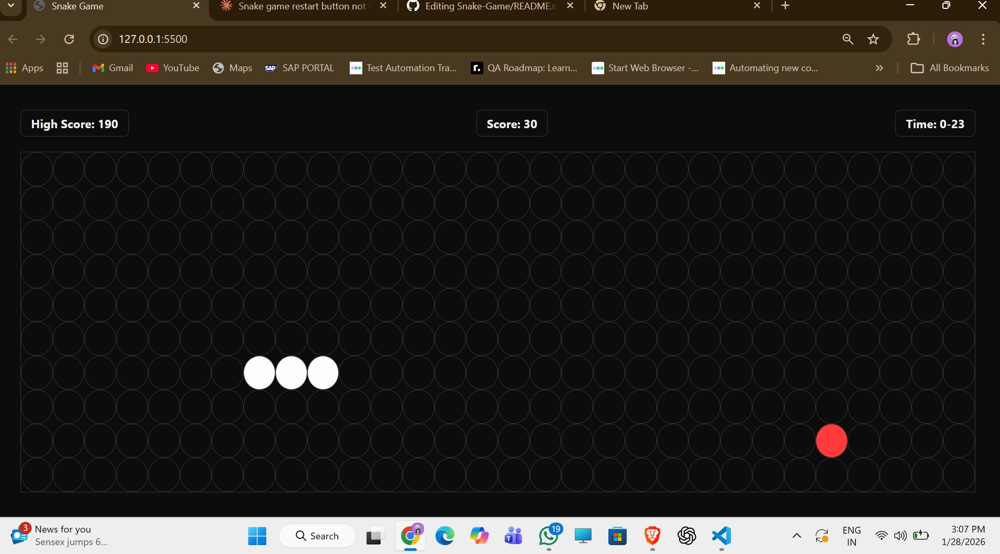

# 🐍 Snake Game

A classic Snake Game built using JavaScript logics, HTML, CSS.

## 🎮 Play Now
[Click here to play](https://your-username.github.io/snake-game/)

## 🎯 Features
- Responsive game board
- Score tracking
- Game over & restart functionality
- Keyboard controls (Arrow keys)

## 🛠️ Technologies Used
- HTML5
- CSS3
- Vanilla JavaScript

## 📸 Screenshot

## 🕹️ How to Play
- Use **Arrow Keys** to control the snake
- Eat the food to grow longer
- Avoid hitting the walls
- Try to beat your high score!

## 👨‍💻 Author
----- Anupam Vats

